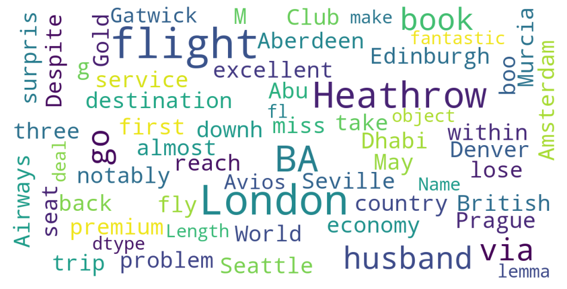
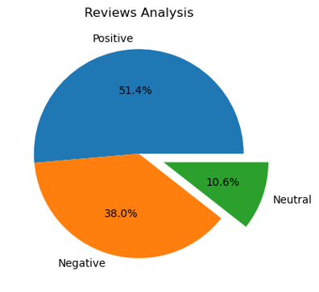
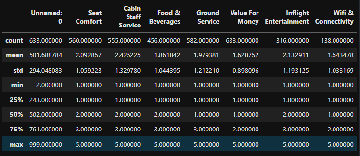
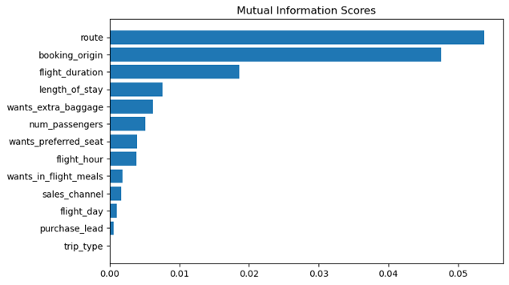

# What is the forage ?
Forage offers free, very-short virtual work experiences, which are online programs designed and delivered by leading 
companies. Each virtual work experience contains a series of resources and tasks designed to simulate the real-world experience of starting a career

## British-Airways-Virtual-Internship

## Task 1 : Web Scraping to gain company insights

Business problem : British airways (BA) want to understand how people view BA customer experience to make our operations run more efficiently and make our customer experience even better.

For this task, I did web scraping using the beautifulsoup library on the following website: https://www.airlinequality.com/airline-reviews/british-airways

from that website, I take the information I need like customer reviews and services ratings. then I analyze the data and give me this insight :

   

From the wordcloud above, we can see the key of topics in customer review are flight, seat , service and time. showing that people are actively talking about their experience on the plane and the staff.

but it's a good review or bad review? let's analyze more deeply.

   

63.3% of our customers are dissatisfied with their flights, what are the reasons?

   

on the picture above, we can see the average rating each service is low. the lower is the value of money and food and beverages, so I analyze that service and what I found are:

1. for the food and beverages, customers complain because the time to receive food orders is too long and too few food choices, then for free catering all you get is a bottle of water and a packet of crisps,

2. for the value of money, customers complain because the time to get a refund is too long, there are even some customers who are forced to use vouchers which make them spend more money, then there are delays from flights that are quite long

then for this problem, I propose :
1. Give them better free catering such as customers can choose to get water or soda, then for food they can be given pastries or bread so they feel more full
2. Highlight services can order food and drinks before the flight so they can order before the flight and we can prepare those orders more quickly
3. Give the valueable voucher to customer and provide education to employees so as not to force customers to use vouchers

## Task 2 : Predicting customer buying behaviour

Business Problem : British Airways want to know what factors influence customers to complete or cancel their booking processes.

For this task, I make predictive model with XGBoost to get feature importance.

Dataset (customer_booking) already be cleaned because it's dont have duplicate and null value, so we can start analyze the data.

out of 50,000 booking processes made by customers, only 7,474 booking processes were completed. why did this happen?

To find out, I made a machine learning model to take the feature importance, the results are:

   

There are 2 features that greatly affect whether the booking process will be completed by the customer :
1. Purchase_lead (number of days between travel date and booking date)
   It was found that the unfinished booking process has a higher average purchase_lead value than the completed booking process.
2. Length_of_stay
   the same as purchase leads, where the average value of length_of_stay from bookings that are not completed is higher than bookings that are completed

so to solve the problem, I suggest to :
1. Providing attractive offers such as getting a higher discount if customer order before 30 days of flight.
2. Provide rescheduling options to customers with a maximum deadline of 3 days before the flight.

> My certificate

   

